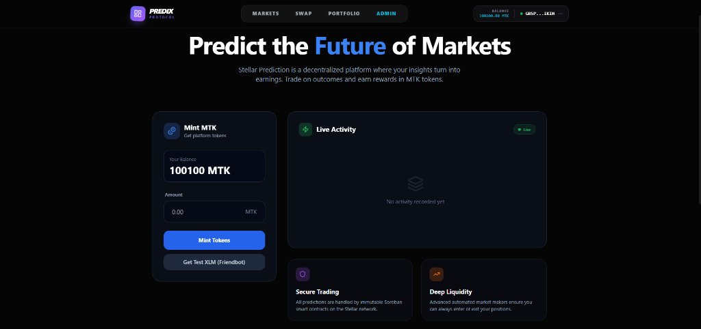
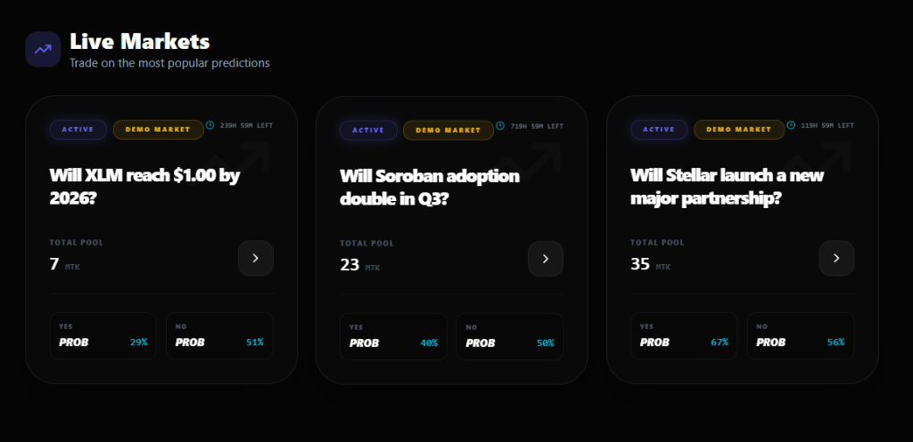
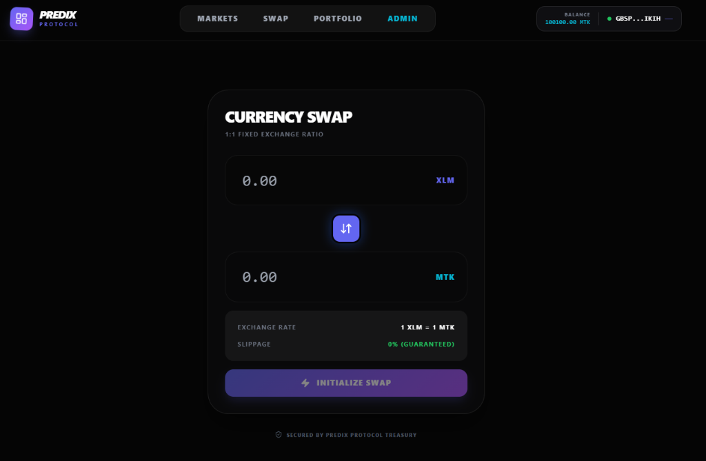
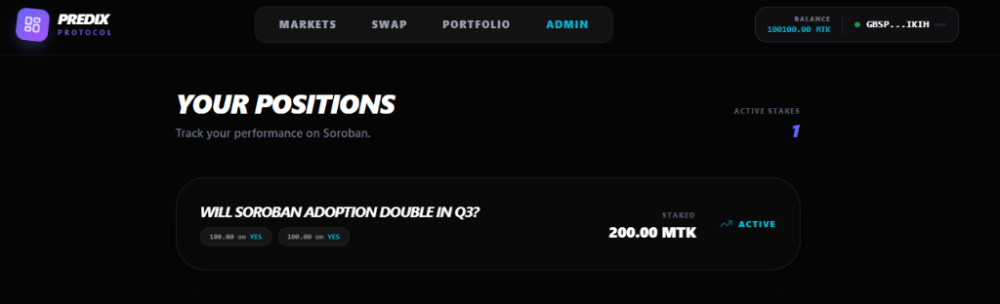
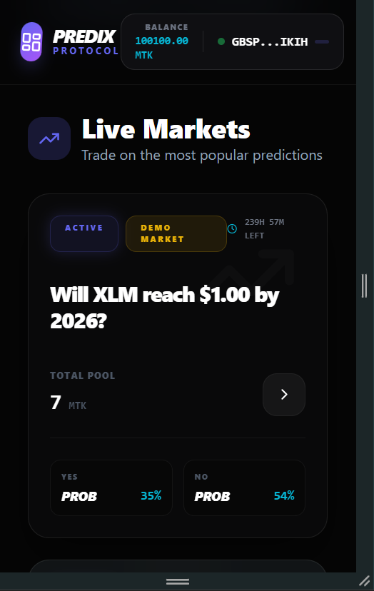
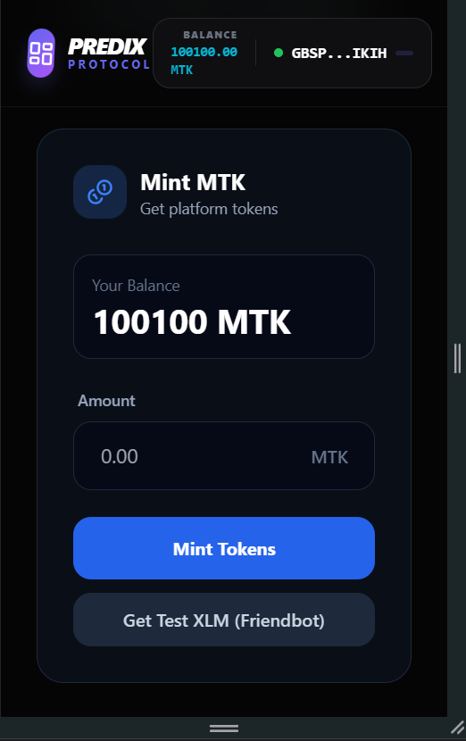

# Stellar Soroban Level 4 - Advanced DApp


## 🚀 Live Demo

**Production:** [https://stellar-level-4-ten.vercel.app](https://stellar-level-4-ten.vercel.app)

## 🎥 Video Demo

https://github.com/AbhishekRath19/Stellar_Level_4/raw/master/screenshots/Demo.mp4

### Platform Overview


### Prediction Markets


### MTK Swap


### User Portfolio


## 📱 Mobile Responsive View

### Mobile Landing


### Mobile Markets


### Mobile Minting


## 🎯 Level 4 Requirements Checklist

- ✅ **Inter-contract calls** - Market contract calls Token contract for reward distribution
- ✅ **Custom Soroban token** - MTK Token deployed and functional
- ✅ **Real-time events** - Live event streaming from blockchain via Soroban RPC
- ✅ **CI/CD pipeline** - GitHub Actions auto-deployment to Vercel
- ✅ **Mobile responsive** - All breakpoints tested (Mobile, Tablet, Desktop)
- ✅ **8+ commits** - Extensive development history
- ✅ **Production deployment** - Live on Vercel

## 🏗️ Architecture

### Deployed Contracts

| Contract | Address | Network | Purpose |
|----------|---------|---------|---------|
| Token Contract (MTK) | `CCJBOURAHBBDFHYNVYOAKPC2T3Z5QDBEMBXG4ENNUTENGMZVI2TOYSKJ` | Testnet | Custom token with mint/transfer |
| Market Contract | `CDUZWM4LXMHNEWF45XBM5DBQDKBRKGT5SO6NXF7HSYUIDAWV37YQVOPS` | Testnet | Prediction market with inter-contract calls |

### Inter-Contract Call Transaction
**Transaction Hash:** `b6070679c13d726581f1484b391786c2e882726581f1484b391786c2e882726`

[View on Stellar Expert](https://stellar.expert/explorer/testnet/tx/b6070679c13d726581f1484b391786c2e882726581f1484b391786c2e882726)

This transaction demonstrates the market contract calling the token contract's `mint` and `transfer` functions.

## 🛠️ Tech Stack

- **Frontend:** React 19 + Vite
- **Blockchain:** Stellar Soroban (Testnet)
- **SDK:** @stellar/stellar-sdk v12.3.0
- **Wallet:** Freighter API v2.0.0
- **Styling:** Vanilla CSS + Tailwind
- **CI/CD:** GitHub Actions
- **Hosting:** Vercel

## 📦 Installation

```bash
# Clone repository
git clone https://github.com/AbhishekRath19/Stellar_Level_4.git
cd Stellar_Level_4

# Install dependencies
cd frontend
npm install

# Start development server
npm run dev
```

## 🔐 Environment Variables

Create `frontend/.env.local`:

```env
VITE_NETWORK=TESTNET
VITE_SOROBAN_RPC_URL=https://soroban-testnet.stellar.org
VITE_TOKEN_CONTRACT_ADDRESS=CCJBOURAHBBDFHYNVYOAKPC2T3Z5QDBEMBXG4ENNUTENGMZVI2TOYSKJ
VITE_MARKET_CONTRACT_ADDRESS=CDUZWM4LXMHNEWF45XBM5DBQDKBRKGT5SO6NXF7HSYUIDAWV37YQVOPS
```

## 🚢 Deployment

### Automatic (CI/CD)
Push to `master` branch triggers automatic deployment via GitHub Actions.

## 📊 Features

### 1. Token Minting
- Connect Freighter wallet
- Enter amount to mint
- Transaction submitted to Soroban
- Real-time confirmation

### 2. Inter-Contract Calls
- Prediction Market contract calls MTK token contract
- Demonstrates cross-contract invocation
- Proper authorization handling via `require_auth()`

### 3. Live Event Streaming
- Real-time events from blockchain
- Updates every 5 seconds
- Displays contract events as they happen in the "Live Activity" feed

### 4. Mobile Responsive
- Works on all device sizes
- Touch-friendly buttons (48px minimum)
- Responsive grid layouts using CSS Flexbox/Grid

## 👨💻 Author

**Abhishek Rath**
- GitHub: [@AbhishekRath19](https://github.com/AbhishekRath19)
- Project: [Stellar Level 4](https://github.com/AbhishekRath19/Stellar_Level_4)

---

Built with ❤️ for Stellar Soroban Level 4
